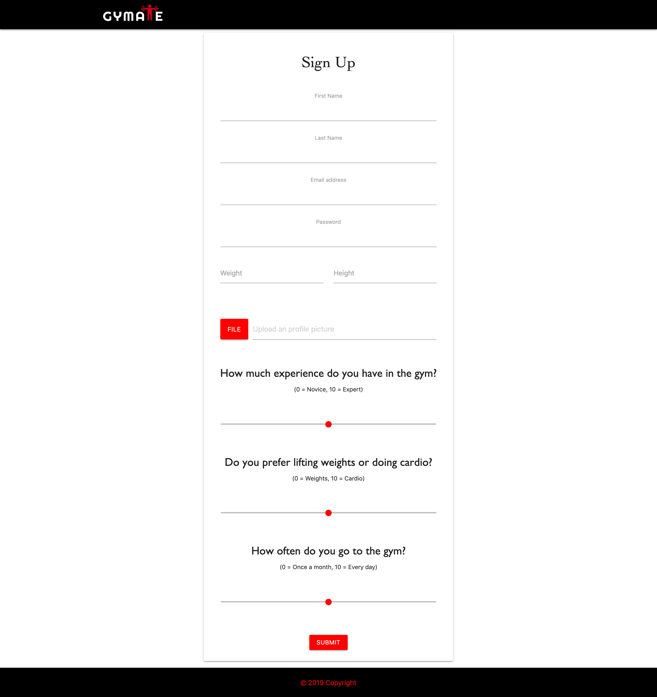

# Gymate

A way to plan your workout routines and meet new friends! Record your time working out and weight loss to see progress and look up popular workout routines.

<br>

### Link to delopyed site

https://gymate123.herokuapp.com/

### Author

Author : [Jacobs](https://github.com/gljacobs)

Author : [Chloe](https://github.com/chloezhouny)

Author : [Matt](https://github.com/matkuh)

Author : [Megha](https://github.com/meghabprasad)

### Site Images





<br>


### Tech Used

1. [JavaScript](https://www.javascript.com/)
2. [Node](https://nodejs.org/en/)

- Node.js is an open-source, cross-platform JavaScript run-time environment that executes JavaScript code outside of a browser. 
- Node.js lets developers use JavaScript to write command line tools and for server-side scripting—running scripts server-side to produce dynamic web page content before the page is sent to the user's web browser

3. [MySQL2](https://www.npmjs.com/package/mysql2)

- MySQL (structured query language) is a relational database management system (RDBMS) and is considered one of the worlds most popular open source databases. MySQL2 project is a continuation of MySQL-Native. Protocol parser code was rewritten from scratch and api changed to match popular mysqljs/mysql. 

4. [Sequelize/Cli](http://docs.sequelizejs.com/)

- Sequelize is a promise-based Node.js ORM for Postgres, MySQL, MariaDB, SQLite and Microsoft SQL Server. It features solid transaction support, relations, eager and lazy loading, read replication and more. The Sequelize Command Line Interface (CLI) ships support for migrations and project bootstrapping.


5. [Express](https://expressjs.com/)

- Express is a web application framework for Node.js, released as free and open-source software under the MIT License. It is designed for building web applications and APIs and is the standard server framework for Node.js

6. [Handlebars](https://www.npmjs.com/package/handlebars)

- Handlebars.js is an extension to the Mustache templating language. Handlebars.js and Mustache are both logicless templating languages that keep the view and the code. It's one of the more popular Githib/NPM packages with over 5.3 million downloads within the last month!

7. [Okta](https://www.okta.com/)

- A user authentication service that allows developers to build identity controls into applications, website web services and  devices.
- Create a file called `.env` in the project root and add the following variables, replacing the values with your own from the previous steps.

```
    HOST_URL=http://localhost:3000
    ORG_URL=https://dev-123456.oktapreview.com
    CLIENT_ID=okta-application-client-id
    CLIENT_SECRET=okta-application-client-secret
    REGISTRATION_TOKEN=okta-registration-api-token
    USER_PROFILE_TOKEN=okta-user-profile-api-token
    APP_SECRET=something-random
```

8. [AWS-SDK S3](https://aws.amazon.com/sdk-for-node-js/)

- Amazon S3, or amazon simple storage service allows you to store and retrieve any amount of data at any time, anywhere from the web. 
- Buckets and objects are resources, and Amazon S3 provides APIs for you to manage them. You can create a bucket and upload objects using the Amazon S3 API


## How it Works

#### User Login

User creates an account on the signup page and inputs name, email, password, height, weight, and can upload an image. 

#### Choose Routine

User can pick a routine and add it to their current routines.  It will then show up on their profile and the user can edit or add workouts by day.

#### Update Stats and Post

User can update their weight loss and hours spent on a routine and then make a post about the workout.

### What We Learned

1. Have a more defined MVP and stick to it
 - Throughout the project we all had different ideas of what we wanted in our MVP and this caused a lot of issues since many of the features conflicted with eachother. 
 Solution - Have a set MVP and keep to it.  If we come up with other idea, add them to stretch goals and focus on finishing the MVP first. 

2. Communication is important, expecially in the starting stages of the project
- We definitely had some communication issues in the beginning.  The first couple days we were unsure where to start and did not have a proper standup to decide what everyone was going to work on.  
Solution - Either meet up in person or have more voice calls.  Be more responsive on slack and messaging and communicate when you're working on something.

3. If a feature isn't working, don't waste to much time trying to figure it out.
- We found an project that had implemented okta and tried to use what they had with gymate. Merging the files created a lot of problems and we probably spent 2-3 days trying to work out that issue.
Solution - we should have either not used it or tried a different authentication service after the first couple days of not getting it to work.  
